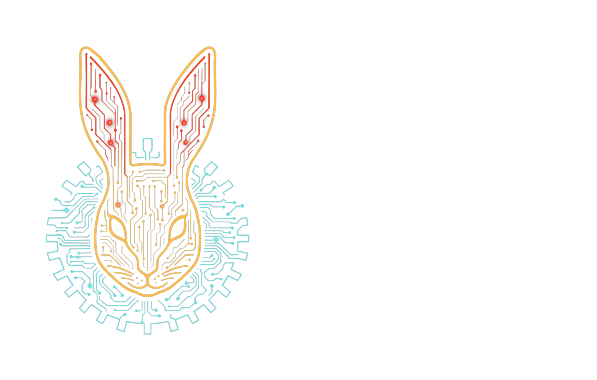

<!-- BANNERS START -->
<p align=center></p>

<p align=center>
    <a href="https://github.com/wabbit-corp/kotlin-base58/blob/main/LICENSE.md"></a>
    <a href="https://github.com/wabbit-corp/kotlin-base58"></a>
</p>

---

# Wabbit Dev Toolkit

This repository contains a collection of Python utilities used to automate
various development workflows.  The entry point for the command line interface
is `dev.py` which exposes a number of sub‑commands for project management,
repository checks, publishing, dependency analysis and more.

The code lives primarily inside the `dev/` package.  It includes helpers for
working with Git repositories, interacting with GitHub, generating banners,
and running quality checks across a repository.  Several tasks are implemented
under `dev/tasks`, for example:

* `check` – run linting and repository validation checks
* `dep/graph` – output a graph of project dependencies
* `dep/updates` – report outdated dependencies
* `commit` and `push` – Git helper commands
* `setup` – initialise a new repository using templates

Tests for various modules are located in `dev/test_*.py`.

## 🚀 Installation

This project requires Python 3.11+.  Dependencies are listed in
`requirements.txt` and can be installed with:

```bash
pip install -r requirements.txt
```

## 🚀 Usage

Invoke the CLI by running:

```bash
python dev.py <command> [options]
```

For example, to run repository checks on the current directory:

```bash
python dev.py check .
```

To list outdated dependencies:

```bash
python dev.py dep/updates
```

Consult `python dev.py --help` for the full list of commands and options.

## Repository Layout

```
├── dev.py              # CLI entry point
├── dev/                # Library code and tasks
│   ├── checks/         # Repository and code quality checks
│   ├── tasks/          # Individual CLI commands
│   └── ...
├── requirements.txt    # Python package requirements
└── TODO.md             # High level development notes
```

## Licensing

This project is licensed under the [AGPL](LICENSE.md) for open source use.

For commercial use, please contact Wabbit Consulting Corporation (at wabbit@wabbit.one) for licensing terms.

## Contributing

Before we can accept your contributions, we kindly ask you to agree to our [Contributor License Agreement (CLA)](CLA.md).
