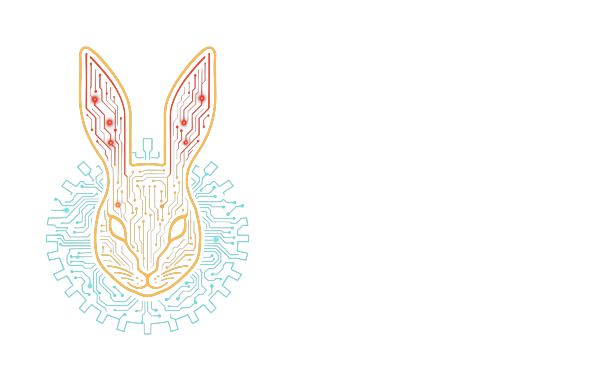

<!-- BANNERS START -->
<p align=center></p>

<p align=center>
    <a href="https://github.com/wabbit-corp/wabbit-dev/blob/main/LICENSE.md"></a>
    <a href="https://github.com/wabbit-corp/wabbit-dev"></a>
</p>

---

# Wabbit Dev Toolkit

`wabbit-dev` is the workspace automation CLI used across the Wabbit repositories.
It reads project metadata from `root.clj` and `root.private.clj`, then uses that
configuration to:

- generate managed project files
- run repo and source checks
- inspect dependency graphs and updates
- build configured projects
- publish releases
- automate common git maintenance tasks

The main entrypoints are:

- `dev ...` after installation
- `wabbit-dev ...` as a compatible explicit alias

## Installation

`wabbit-dev` requires Python 3.12 or newer.

Install the published package:

```bash
python3 -m pip install wabbit-dev
```

This installs both `dev` and `wabbit-dev`.

Install it from a checkout for local development:

```bash
python3 -m venv .venv
. .venv/bin/activate
python3 -m pip install -e .
```

That editable install also exposes `dev` and `wabbit-dev` inside the active
virtualenv.

If you also want the test and packaging toolchain:

```bash
python3 -m pip install -r requirements.txt -r requirements-dev.txt
```

Docs dependencies live outside `requirements-dev.txt`. Install them separately:

```bash
python3 -m pip install "mkdocs>=1.6,<2.0" "mkdocs-material>=9.6,<9.7" "pymdown-extensions>=10,<11"
```

Enable shell completion:

```bash
dev install completions
```

## Quick Start

Validate the workspace configuration:

```bash
dev config check
```

Inspect the configured project inventory:

```bash
dev project list
dev where
dev checkout --dry-run
```

Generate managed files for a project and its dependencies:

```bash
dev setup --local app-datatron
```

Run checks:

```bash
dev check :root
dev check app-wabbit-dev
dev spdx headers . --fix
dev docs check app-wabbit-dev
dev ask gpt "Summarize the current release blockers."
```

Build a configured project:

```bash
dev build app-datatron
```

Verify release readiness without publishing:

```bash
dev verify release app-wabbit-dev
```

## Command Reference

Core commands are summarized here. The full command reference, including nested
subcommands and compatibility aliases, lives in
[docs/commands.md](docs/commands.md).

| Command | What it does |
| --- | --- |
| `install app [--bin-dir DIR]` | Installs or refreshes global `dev` and `wabbit-dev` launcher wrappers. |
| `install completions [--shell all\|bash\|zsh] [--no-rc]` | Installs completion scripts and managed shell rc snippets. |
| `install tools [--tool TOOL] [--force] [--json]` | Installs optional local scanners, QA tools, and formatters into `.tools` or the workspace Python environment. |
| `completion bash` / `completion zsh` | Prints shell completion scripts with dynamic command, target, and check-name completion. |
| `doctor [TARGET ...] [--only CHECK_OR_COMMAND] [--json]` | Diagnoses workspace, toolchain, and credential readiness, optionally scoped to selected checks or targets. |
| `docs check [TARGET ...] [--semantic] [--json]` | Validates docs links, sections, snippets, hooks, and optional semantic quality such as unclear purpose or weak quickstarts, with constrained repo-local inspection in semantic mode. |
| `docs snippets [TARGET ...] [--verify] [--json]` | Validates fenced docs snippets, with optional deeper project-specific verification. |
| `where [--json]` | Shows the workspace, repo, and project context inferred from the current directory. |
| `checkout [TARGET ...] [--dry-run] [--json]` | Clones missing configured repositories into their `root.clj` paths. |
| `config check` | Parses and validates `root.clj` and `root.private.clj`. |
| `setup [TARGET ...] [--commit-if-setup-only] [--json]` | Generates or refreshes managed project files from configuration, with an optional safe post-setup auto-commit mode. |
| `llmcopy PATH ...` | Copies file contents to the clipboard in an LLM-friendly wrapper and reports GPT-5.4 token totals. |
| `ask gpt\|claude\|gemini [--conversation ID] [--file FILE]... [--model MODEL] [TEXT ...]` | Asks a hosted model, attaches text or image files, and caches the conversation locally for reuse. |
| `dep graph [TARGET ...]` | Renders an SVG dependency graph for the workspace or selected configured targets. |
| `dep updates` | Checks configured Maven libraries for newer upstream versions. |
| `publish [TARGET ...] [--dry-run]` | Publishes configured projects in dependency order or prints the publish plan. |
| `release verify [TARGET ...] [--json]` | Verifies publishable Python and Gradle projects without uploading artifacts. |
| `security scan [TARGET ...] [--tool TOOL] [--json]` | Runs opt-in external security scanners when available and applicable. |
| `build [TARGET ...] [--json]` | Builds configured Gradle projects or syntax-checks Python projects. |
| `duplicates FOLDER ...` | Finds duplicate files and duplicate directory trees. |
| `jitpack info GROUP ARTIFACT [VERSION]` | Shows refs, commits, versions, and build info for a JitPack artifact. |
| `clean [TARGET ...]` | Deletes generated build and cache directories for configured projects. |
| `cloc [TARGET ...]` | Runs `cloc` for configured targets or arbitrary filesystem paths. |
| `status [TARGET ...] [--json]` | Shows staged, unstaged, and untracked repo status for the current or selected targets. |
| `untracked [--all] [--json]` | Shows workspace files and directories not covered by `root.clj`. |
| `commit [TARGET ...] [--dry-run]` | Runs PROD setup, stages changes, and creates commits, or prints the commit plan. |
| `push [TARGET ...] [--dry-run]` | Pushes the current branch to its configured upstream when it can fast-forward, or prints the push plan. |
| `pull [TARGET ...] [--dry-run]` | Fast-forwards local branches from their configured upstreams, or prints the pull plan. |
| `project list` | Lists configured projects grouped by repository. |
| `project show [TARGET ...] [--json]` | Shows detailed metadata for one or more configured projects. |
| `project deps [TARGET ...] [--json]` | Shows resolved dependencies for one or more configured projects. |
| `project repo [TARGET ...] [--json]` | Shows repo metadata for one or more configured targets. |
| `project targets [TARGET ...] [--json]` | Shows Kotlin Multiplatform target platforms for matching configured projects. |
| `check list [--json]` | Lists the loaded checks with scope, auto-fix support, and summaries. |
| `check describe CHECK [--json]` | Shows issue IDs, config knobs, and suppression examples for one check. |
| `check [TARGET] [CHECK ...]` | Runs the loaded check suite against a project, repo, path, or file. |
| `spdx headers [TARGET] [--fix]` | Runs only the SPDX header check. |
| `secrets scan [TARGET]` | Runs the internal high-entropy-string secret scan. |
| `contributors audit` | Audits contributor identity mismatches across configured repos. |

Additional helper:

| Helper | What it does |
| --- | --- |
| `dev/tasks/choose-jvm.py` | Selects the best installed JVM for a named policy, project, or legacy query. |

## Configuration Overview

The CLI is driven by two files at the workspace root:

- `root.clj`: public workspace metadata, project definitions, dependency aliases,
  build defaults, check suppressions, and repository layout
- `root.private.clj`: private credentials and local secrets such as API tokens,
  publish credentials, and default git identity

Config-driven commands can be run from the workspace root or any nested
subdirectory inside it. The CLI walks upward until it finds `root.clj`.

Many target-oriented commands also infer a default target from the current
directory. For example, running `dev build` from inside a configured
project builds that current project; running `dev status` from
inside a configured repo shows that current repo. Use `dev where` to
see the inferred workspace, project, and repo context.

Common `root.clj` forms include:

```clojure
(checks/disable "E_HARDCODED_URL" "**/LICENSE.md")
(define-maven-repo "repo:jitpack" "https://jitpack.io")
(define-maven-library "kotlin-stdlib" "org.jetbrains.kotlin:kotlin-stdlib:2.3.10")

(python "app-wabbit-dev"
  :version "1.1.0"
  :features [
    (python-application
      :script "wabbit-dev"
      :entry "dev.cli:main"
      :path "dev.py")])

(gradle "app-datatron"
  :version "1.0.0"
  :features [(jvm-kotlin-application :main "datatron.MainKt")]
  :dependencies [":kotlin-minilog" "sqlite-jdbc"])

(repo "jeeves"
  :repo "wabbit-corp/jeeves"
  :projects [
    (gradle "api" :version "0.0.1" :buildModel "kmp")
    (gradle "client" :version "0.0.1" :buildModel "kmp")])
```

Dependency inputs can reference:

- another configured project: `":kotlin-minilog"`
- a named library alias: `"sqlite-jdbc"`
- a direct Maven coordinate: `"org.jsoup:jsoup:1.21.2"`
- a modified dependency call: `(dep "kotlin-compiler-embeddable" "compileOnly")`
- an npm dependency: `"npm:react:18.3.1"`
- a jar path: `"./libs/custom-tooling.jar"`

Full configuration reference:

- [docs/configuration.md](docs/configuration.md)

## Checks and Suppressions

`check` honors:

- `.gitignore`
- `.checkignore`
- path-based suppressions in `root.clj` via `(checks/disable ...)`
- value-based suppressions in `root.clj` via `(checks/ignore-finding ...)`
- inline ignore pragmas such as:

```python
HOST = "10.0.0.0"  # check:ignore E_HARDCODED_INTERNAL_HOSTNAME_IP value=10.0.0.0
```

The main target forms are:

- `dev doctor`
- `dev doctor --only publish app-wabbit-dev`
- `dev doctor --json`

`dev doctor` treats missing local publish credentials as advisory when releases
are expected to run through GitHub Actions. Local publish credential checks stay
strict when you run `dev publish`.

- `dev docs check app-wabbit-dev`
- `dev docs check --semantic app-wabbit-dev`
- `dev build app-wabbit-dev --json`
- `dev ask gpt "Summarize the current release blockers."`
- `dev ask claude --conversation docs-review --file README.md "Review this README."`
- `dev setup app-wabbit-dev --json`
- `dev status app-wabbit-dev --json`
- `dev check list`
- `dev check list --json`
- `dev check describe SpdxHeaderCheck`
- `dev check describe SpdxHeaderCheck --json`
- `dev check .`
- `dev check path/to/file.py`
- `dev check app-wabbit-dev`
- `dev check jeeves`
- `dev check :app-wabbit-dev`
- `dev check :root`
- `dev check docs .`
- `dev check kotlin-base58 docs`
- `dev secrets scan .`
- `dev security scan .`
- `dev install tools --tool gitleaks --tool ktfmt`
- `dev security scan --tool gitleaks --tool shellcheck .`

Inventory commands:

- `dev project list`
- `dev project show app-wabbit-dev`
- `dev project show app-wabbit-dev --json`
- `dev project deps jeeves`
- `dev project deps jeeves --json`
- `dev project repo jeeves`
- `dev project repo jeeves --json`
- `dev project targets`
- `dev project targets jeeves --json`
- `dev contributors audit`

Dry-run commands:

- `dev publish --dry-run app-wabbit-dev`
- `dev commit --dry-run jeeves`
- `dev push --dry-run .`

## Documentation

MkDocs pages live under `docs/`:

- [docs/index.md](docs/index.md)
- [docs/installation.md](docs/installation.md)
- [docs/commands.md](docs/commands.md)
- [docs/configuration.md](docs/configuration.md)
- [docs/development.md](docs/development.md)

Build the docs locally with:

```bash
mkdocs build --strict
```

## Packaging

Build a single-file executable with PyInstaller:

```bash
python3 scripts/build_executable.py
```

Artifacts are emitted under `dist/`.

Build a macOS installer:

```bash
scripts/build_macos_installer.sh --version 0.1.0
```

Artifacts:

- `dist/wabbit-dev-<version>.pkg`
- `dist/wabbit-dev-<version>.dmg`

Optional signing and notarization environment variables:

- `INSTALLER_SIGN_IDENTITY`
- `NOTARYTOOL_PROFILE`
- `NOTARYTOOL_APPLE_ID`
- `NOTARYTOOL_PASSWORD`
- `NOTARYTOOL_TEAM_ID`

## Development

Run the local verification suite before sending changes upstream:

```bash
pytest -q
ruff check .
black --check .
mypy .
mkdocs build --strict
```

This repository generates some managed files from `root.clj`. If you change the
configuration model or template behavior, run the relevant `setup` commands and
review the generated output before committing.

When a generated config needs durable manual additions, use the sanctioned
sidecar file instead of editing the generated file directly:

- `build.extra.gradle.kts` for extra Gradle build logic
- `settings.local.gradle.kts` for local Gradle include/substitution overrides
- `pyproject.extra.toml` for additional unmanaged TOML sections
- `mkdocs.extra.yml` for additional unmanaged MkDocs top-level keys

`pyproject.extra.toml` and `mkdocs.extra.yml` are append-only escape hatches.
Do not redefine tables or keys already generated by `setup`.

Generated Python `pyproject.toml` files also carry a standardized source
distribution policy:

- `[tool.poetry].include` / `exclude` define the intended sdist contents
- `[tool.check-manifest].ignore` keeps `check-manifest` aligned with that
  policy for repo-only noise like `.github/`, `.llm/`, and `docs-research/`

That means Python projects do not need a separate hand-maintained `MANIFEST.in`
just to satisfy release verification.

Managed generated config files also carry a short integrity stamp. `check` uses
that stamp to distinguish hand-edited managed files from files that are merely
stale and need regeneration.

For setup-driven config refreshes that should be checkpointed immediately, use
`dev setup --commit-if-setup-only <target>`. That post-setup auto-commit path
is intentionally narrow: it only commits when the repo stays on `master`, has
no untracked files, and the remaining diffs are limited to `root.clj`,
`.gitignore`, and setup-managed generated files.

`setup` also owns a small repo-root metadata bundle for Wabbit-managed repos:

- `.editorconfig`
- `.github/CODEOWNERS`
- `.github/SECURITY.md`
- `.github/pull_request_template.md`
- `.github/ISSUE_TEMPLATE/bug_report.yml`
- `.github/ISSUE_TEMPLATE/feature_request.yml`

Those GitHub-specific files live under `.github/` on purpose to avoid turning
the repo root into a pile of community-policy documents.

`setup` can also manage a very small facts block in a repo-root `AGENTS.md`.
If `AGENTS.md` is missing, setup may create a short starter file. If it already
exists, setup updates only the block between the managed markers and leaves the
rest of the file alone. Keep any human-authored instructions outside that block.

## Licensing

This project is licensed under the [AGPL](LICENSE.md) for open source use.

Additional license notices and custom license texts, when needed, live in
`NOTICE.md` and `LICENSES/`.

For commercial use, contact Wabbit Consulting Corporation at `wabbit@wabbit.one`.

## Contributing

Before contributions can be accepted, contributors must agree to the
[Contributor License Agreement](legal/cla/v1.0.0/CLA.md).
